# Query Processing Flow: Frontend to Backend

This document traces the complete flow of how a user's query is processed from frontend to backend in the RAG Chatbot system.

## Visual Flow Diagram

```mermaid
flowchart TD
    %% Frontend Layer
    User["👤 User Input"] --> FE["Frontend - script.js"]
    FE --> Validate{"Validate Query"}
    Validate -->|Empty| FE
    Validate -->|Valid| UI["Update UI<br/>- Disable input<br/>- Show loading<br/>- Add user message"]
    
    %% HTTP Layer
    UI --> HTTP["HTTP POST /api/query<br/>Content-Type: application/json<br/>Body: query and session_id"]
    
    %% Backend Entry
    HTTP --> API["FastAPI Endpoint<br/>app.py:56-74"]
    API --> Parse["Parse QueryRequest Model"]
    Parse --> Session{"Session ID exists?"}
    Session -->|No| CreateSession["Create New Session"]
    Session -->|Yes| UseSession["Use Existing Session"]
    CreateSession --> RAG
    UseSession --> RAG["RAG System<br/>rag_system.py:102-140"]
    
    %% RAG Processing
    RAG --> Prompt["Wrap Query in<br/>Instructional Prompt"]
    Prompt --> History["Retrieve Conversation<br/>History from SessionManager"]
    History --> AIGen["AI Generator<br/>ai_generator.py:43-87"]
    
    %% AI Processing
    AIGen --> SystemPrompt["Build System Prompt<br/>with Context"]
    SystemPrompt --> Claude1["Initial Claude API Call<br/>with Tools Enabled"]
    Claude1 --> Decision{"Claude Decision"}
    
    %% Tool Execution Branch
    Decision -->|Use Tool| ToolExec["Tool Execution Flow<br/>ai_generator.py:83-135"]
    ToolExec --> ToolMgr["ToolManager Execute<br/>search_tools.py"]
    ToolMgr --> CourseSearch["CourseSearchTool<br/>Execute Method"]
    CourseSearch --> VectorStore["Vector Store Search<br/>ChromaDB + Embeddings"]
    VectorStore --> FormatResults["Format Results with<br/>Course/Lesson Context"]
    FormatResults --> TrackSources["Track Sources for UI"]
    TrackSources --> Claude2["Second Claude API Call<br/>with Search Results"]
    Claude2 --> FinalResponse["Final Response Generation"]
    
    %% Direct Response Branch
    Decision -->|Direct Answer| FinalResponse
    
    %% Response Assembly
    FinalResponse --> UpdateSession["Update Session History<br/>SessionManager"]
    UpdateSession --> GetSources["Retrieve Sources<br/>from ToolManager"]
    GetSources --> ResetSources["Reset Sources for<br/>Next Query"]
    ResetSources --> ResponseTuple["Return response and sources"]
    
    %% Backend Response
    ResponseTuple --> APIResponse["Construct QueryResponse<br/>- answer<br/>- sources<br/>- session_id"]
    APIResponse --> JSON["JSON Response"]
    
    %% Frontend Response Handling
    JSON --> FEResponse["Frontend Response Handler<br/>script.js:76-95"]
    FEResponse --> UpdateSessionID{"New Session ID?"}
    UpdateSessionID -->|Yes| StoreSession["Store Session ID"]
    UpdateSessionID -->|No| DisplayResponse
    StoreSession --> DisplayResponse["Display AI Response<br/>with Sources"]
    DisplayResponse --> RemoveLoading["Remove Loading Indicator"]
    RemoveLoading --> EnableInput["Re-enable Input for<br/>Next Query"]
    EnableInput --> User
    
    %% Styling
    classDef frontend fill:#e1f5fe
    classDef backend fill:#f3e5f5
    classDef ai fill:#fff3e0
    classDef data fill:#e8f5e8
    classDef decision fill:#fff8e1
    
    class User,FE,UI,FEResponse,DisplayResponse,RemoveLoading,EnableInput frontend
    class API,Parse,RAG,APIResponse,JSON backend
    class AIGen,SystemPrompt,Claude1,Claude2,FinalResponse,ToolExec ai
    class VectorStore,FormatResults,TrackSources,GetSources,ResetSources data
    class Validate,Session,Decision,UpdateSessionID decision
```



## 1. **Frontend Initiation** (frontend/script.js)

**User Action**: User types query and clicks send button or presses Enter
- `sendMessage()` function triggered (script.js:45)
- Input validation: checks if query is non-empty (script.js:46)
- UI updates: disables input, adds user message to chat, shows loading indicator (script.js:50-60)

## 2. **HTTP Request** (frontend/script.js:63-72)
```javascript
POST /api/query
Content-Type: application/json
Body: {
  "query": "user's question",
  "session_id": currentSessionId  // null for first query
}
```

## 3. **FastAPI Backend Reception** (backend/app.py:56-74)

**Endpoint**: `POST /api/query` 
- Request parsed into `QueryRequest` model (app.py:38-41)
- Session management: creates new session if `session_id` is null (app.py:61-63)
- Delegates to RAG system: `rag_system.query(request.query, session_id)` (app.py:66)

## 4. **RAG System Orchestration** (backend/rag_system.py:102-140)

**Main Query Handler**: `query()` method
- Wraps user query in instructional prompt (rag_system.py:114)
- Retrieves conversation history from session manager (rag_system.py:117-119)
- Delegates to AI generator with tools (rag_system.py:122-127)

## 5. **AI Generation with Tools** (backend/ai_generator.py:43-87)

**Claude API Interaction**: `generate_response()` method
- Builds system prompt with conversation context (ai_generator.py:61-65)
- Prepares API call with tools enabled (ai_generator.py:68-77)
- Makes initial call to Claude (ai_generator.py:80)

## 6. **Tool Execution Flow** (ai_generator.py:83-135)

**If Claude decides to use search tool**:
- Detects `tool_use` stop reason (ai_generator.py:83)
- Calls `_handle_tool_execution()` (ai_generator.py:84)
- Executes search via ToolManager (ai_generator.py:111-114)

## 7. **Course Search Execution** (backend/search_tools.py:52-86)

**CourseSearchTool**: `execute()` method
- Performs semantic search via VectorStore (search_tools.py:66-70)
- Handles errors and empty results (search_tools.py:72-83)
- Formats results with course/lesson context (search_tools.py:86)
- Tracks sources for UI display (search_tools.py:112)

## 8. **Vector Store Search** (backend/vector_store.py)
- ChromaDB semantic search with SentenceTransformer embeddings
- Returns relevant course chunks with metadata
- Handles course name matching and lesson filtering

## 9. **Final Response Generation** (ai_generator.py:123-135)

**Second Claude API Call**:
- Sends search results back to Claude
- Claude synthesizes final answer based on retrieved content
- Returns formatted response text

## 10. **Session Management Update** (backend/rag_system.py:135-137)
- Adds user query and AI response to session history
- Maintains conversation context for follow-up questions

## 11. **Response Assembly** (backend/rag_system.py:129-140)
- Retrieves sources from ToolManager (rag_system.py:130)
- Resets sources for next query (rag_system.py:133)
- Returns tuple of (response, sources)

## 12. **FastAPI Response** (backend/app.py:68-72)
- Constructs `QueryResponse` model with:
  - `answer`: AI-generated response
  - `sources`: Course/lesson references
  - `session_id`: For maintaining conversation

## 13. **Frontend Response Handling** (frontend/script.js:76-95)
- Receives JSON response
- Updates session ID if new (script.js:79-81)
- Removes loading indicator (script.js:84)
- Displays AI response with sources (script.js:85)
- Re-enables input for next query (script.js:92-94)

## **Key Architecture Features**:

1. **Tool-based Search**: Claude decides when to search rather than always retrieving
2. **Session Continuity**: Conversation context maintained across queries  
3. **Source Tracking**: UI shows which courses/lessons informed the response
4. **Error Handling**: Graceful fallbacks at each stage
5. **Semantic Search**: ChromaDB with embeddings for relevant content retrieval
6. **Markdown Support**: AI responses rendered with formatting in frontend

The system flows from user input → HTTP → RAG orchestration → AI + tools → vector search → response synthesis → formatted output.